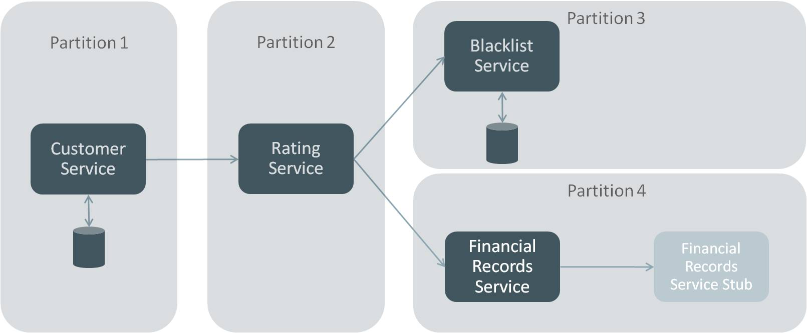
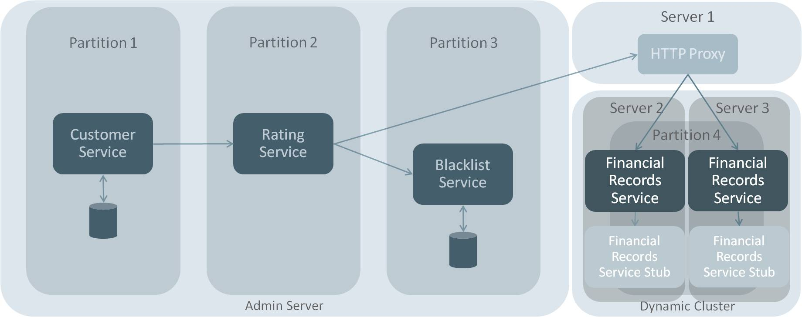
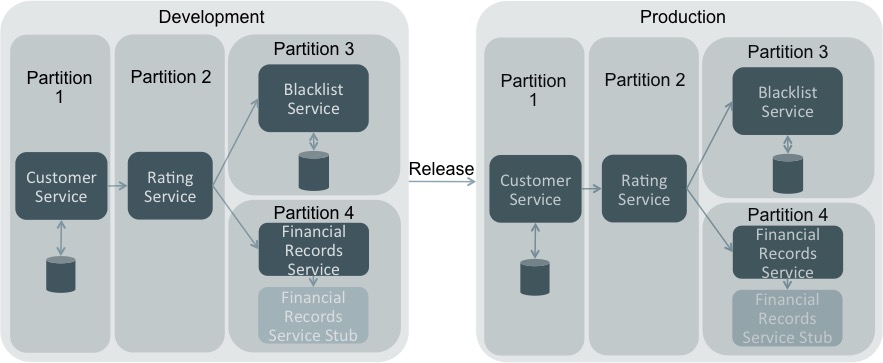

# ClientRating
## Microservices minimal proof of concept

This sample application is meant to demonstrate the development of a Java EE based Microservices application and deployment on WebLogic application server. For that purpose we have created a very minimalistic application demonstrating the scenario of a number of services cooperating in order to calculate a banking customer's rating for the purpose of risk assessment. 

The application is composed of four services. Customer service is the service initiating the call, asking for the rating of all customers in the system. It exposes a REST endpoint through JAX-RS using Jersey and MOXy, returning the result in plain text. The EJB implementing the business functionality performs a JPA query to retrieve all customers and performs a REST call to RatingService to retrieve the customer rating. 

RatingService initially performs a REST call to BlacklistService to verify that the customer has not been blacklisted. The latter performs a JPA query to its own database and returns the status for the customers who are stored there (a subset of the customers requested). Then a call to FinancialRecordsService is performed in order to retrieve the customer's financial history rating from a public authority. A stub is used in the example application to represent this remote call. 

Configuration of the REST endpoints for each service is performed using WebLogic server's Deployment Plans. This feature will be detrimental in implementing the more complex scenarios. The second and third scenarios are about migrating one service to a new dynamic cluster for the purpose of scaling. For that purpose we are also using HttpClusterServlet as a load balancer for the second scenario and Oracle Traffic Director for the third scenario. Fourth scenario demonstrates the ease of migrating the domain partitions to another domain. The fifth scenario explores using Docker for running the WebLogic server.

## Requirements
The application can be built and deployed to a single WebLogic domain using domain partitioning for services separation. Prerequisites for running this example is having a Unix based operating system with [JDK 8](http://www.oracle.com/technetwork/java/javase/downloads/jdk8-downloads-2133151.html) and [Maven](https://maven.apache.org/download.cgi?Preferred=ftp://mirror.reverse.net/pub/apache/) installed, and a [WebLogic 12.2.1 Fusion Middleware Infrastructure](http://www.oracle.com/technetwork/middleware/weblogic/downloads/wls-main-097127.html) installation. 

The following variables can be used to control the setup:

- **ORACLE_HOME** (default: /opt/wls/Oracle_Home)
- **WL_HOME** (default: $ORACLE_HOME/wlserver)
- **DOMAIN_HOME** (default: /opt/wls)
- **DOMAIN_NAME** (default: domain)

Running the third scenario will also require a collocated installation of [Oracle Traffic Director](http://www.oracle.com/technetwork/middleware/webtier/downloads/traffic-director-1373931.html). 

It should be pointed out that due to the nature of OTD it may not be compatible with all platforms.

The fifth scenario will require an existing [Docker](https://www.docker.com/products/docker-toolbox) installation. 

The following variables will additionally be needed to run the fifth scenario:
 
- **JDK_ARCHIVE** The full path to a JDK installation tar.gz archive for Linux x64
- **WLS_ARCHIVE** The full path to the quick installer jar for WebLogic 12.2.1
- **PROXY_URL** (Optional) An HTTP proxy URL if running the example behind a proxy
- **DOCKER_VM** (Optional) The name of the Docker VM if using boot2docker 

## Executing simple scenario

Executing bash script **1.execute_single_server.sh** will build the example, create and configure the WebLogic domain, deploy the example into partitions, display the simple text output of CustomerService and shut down the domain. 

## Executing clustered domain scenario

Executing bash script **2.execute_dynamic_cluster.sh** will build the example, create the Weblogic domain, configure the dynamic cluster, start the domain, deploy the example, display the simple text output of CustomerService and shut down the domain.

## Executing clustered domain using Oracle Traffic Director scenario

Executing bash script **3.execute_dynamic_cluster_otd.sh** will build the example, create the Weblogic domain, configure the dynamic cluster and OTD instance, start the domain, deploy the example, display the simple text output of CustomerService and shut down the domain.

## Executing simple scenario with partition migration

Executing bash script **4.execute_single_server_t2p.sh** will build the example, create and configure two WebLogic domains, deploy the example into partitions to the test domain, display the simple text output of CustomerService on both domains (production domain will fail), export test domain partitions and import them to the production domain, display the output of CustomerService on production domain and finally shut down the domains.

## Executing simple scenario on Docker

Executing bash script **5.execute_single_server_docker.sh** will build the example, create an Oracle Linux + JDK8 + WebLogic image, start a Docker container using that image, create and configure the WebLogic domain, deploy the example into partitions, display the simple text output of CustomerService and stop the Docker container.
